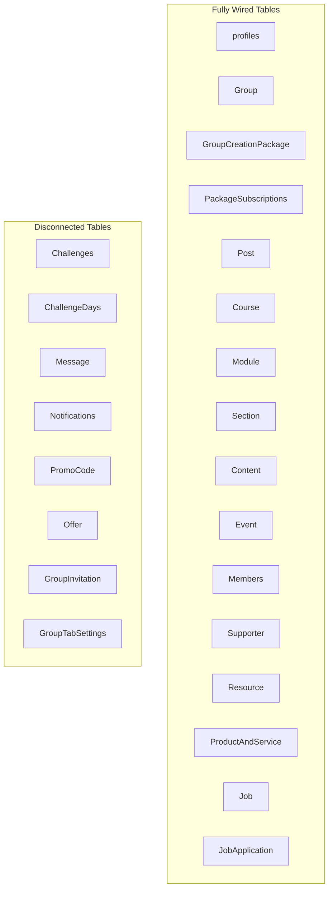

# Larnity App — Comprehensive Project Audit: Static vs. Dynamic Analysis & PM Report

> **Project Name**: Larnity App (Flutter Mobile & Web)  
> **Repository Root**: `lib/`  
> **Target Audience**: Project Manager, Lead Engineer, Stakeholders  
> **Date**: September 2026  
> **Audited By**: Antigravity Technical Audit Engine  

---

## 1. Executive Summary

This report provides an exhaustive, screen-by-screen, and module-by-module technical audit of the **Larnity Flutter Application**. The goal is to determine the exact proportion of features that are **fully dynamic** (connected to Supabase database, authentication, storage, and Riverpod state) versus features that remain **static, hardcoded, or mocked** (UI-only designs, stubbed callbacks, sample data, and non-functional buttons).

### Key Findings at a Glance

* **Overall Project Dynamic Score**: **`46% Dynamic`** | **`54% Static / Mocked`** *(Screen & UI functional level)*
* **Backend Datasource Readiness**: **`72% Implemented`** in Dart datasources, but **`~35%`** of those datasources are **completely disconnected** from their respective UI screens.
* **Authentication & User Profile**: **`95% Dynamic`** — Production-ready Supabase Auth (Email + Google OAuth) and Profile CRUD with storage avatar uploads.
* **Community Rooms & Learning Content**: **`75% Dynamic`** — Course builder, discussion feeds, live calendars, events, doubt mentor directory, job board, product catalog, and digital resources are actively wired to Supabase.
* **Group Administration & Settings**: **`0% Dynamic (100% Static)`** — All 10 settings screens are `StatelessWidget` mockups using hardcoded sample data and empty `onPressed: () {}` buttons.
* **Payment Gateway**: **`0% Real Gateway Integration`** — "Cashfree" and "Paymintro" options exist solely as visual UI placeholders; subscriptions either create unverified direct database rows or trigger simulated `SnackBar` notices.
* **Notification System**: **`10% Dynamic`** — Full Supabase `NotificationDataSource` exists, but the Riverpod provider file is **0 bytes (empty)**, and the notification UI is 100% static mock data.

```
Overall Functional Status:
[█████████████████████████-----------------------------] 46% Dynamic / Wired
[-------------------------█████████████████████████████] 54% Static / Mock / Unconnected
```

---

## 2. Executive Scorecard by Feature Module

| Module Name | Total Screens | % Dynamic | % Static | Primary Backend Table(s) | Status / Risk Level |
| :--- | :---: | :---: | :---: | :--- | :--- |
| **1. Authentication** | 2 | **98%** | **2%** | Supabase Auth, `profiles` | 🟢 Production Ready |
| **2. User Profile** | 1 | **90%** | **10%** | `profiles`, Storage (`avatars`) | 🟢 Fully Functional |
| **3. Packages (Admin Plans)** | 2 | **72%** | **28%** | `GroupCreationPackage`, `PackageSubscriptions` | 🟡 Functional (No real payment) |
| **4. Package Subscriptions** | 3 | **30%** | **70%** | `PackageSubscriptions`, `Group` | 🟡 Core form works, 2 screens static |
| **5. Explore & Marketplace** | 3 | **25%** | **75%** | `Group`, `Members`, `Notifications` | 🔴 Defect in Explore query, Notifications mock |
| **6. Group Hub & Rooms** | 13 | **72%** | **28%** | `Post`, `Course`, `Event`, `Job`, `Resource`, etc. | 🟢 10/12 rooms dynamic; Chat & Challenge static |
| **7. Group Settings** | 10 | **0%** | **100%** | None wired (UI mockups) | 🔴 High Priority Backlog |
| **8. Navigation Shells** | 2 | **50%** | **50%** | GoRouter, `Group` list | 🟡 Navigation works, notification action static |
| **PROJECT TOTAL (Weighted)**| **35 Screens** | **46%** | **54%** | **Supabase Postgres (20+ Tables)** | **Medium-High Implementation Gap** |

---

## 3. Screen-by-Screen Technical Inventory (All 35 Screens)

Below is the complete status of every single screen registered in `app_router.dart`:

| # | Screen Name | File Location | Dynamic % | Static % | Current Implementation Status |
| :-: | :--- | :--- | :-: | :-: | :--- |
| 1 | `AuthScreen` | `features/auth/.../auth_screen.dart` | **95%** | 5% | **Dynamic**: Email/Password login, Signup with first/last name, Google OAuth with ID token exchange, error toasts, and auth redirect. |
| 2 | `ForgotPasswordScreen` | `features/auth/.../forgot_password_screen.dart` | **100%** | 0% | **Dynamic**: Directly triggers Supabase Auth password reset email with client validation and loading indicators. |
| 3 | `ProfileSettingsScreen` | `features/profile/.../profile_settings_screen.dart` | **90%** | 10% | **Dynamic**: Pre-populates from cached/auth user, updates `profiles` row in Supabase, changes password, uploads avatar to Supabase Storage bucket. |
| 4 | `PackageScreen` | `features/package/.../package_screen.dart` | **95%** | 5% | **Dynamic**: Queries `GroupCreationPackage` table from Supabase via `packageProvider`; renders dynamic monthly pricing, limits, and checks active user plan. |
| 5 | `PackageDetailsScreen` | `features/package/.../package_details_screen.dart` | **50%** | 50% | **Partial**: Receives dynamic package extra and inserts record into `PackageSubscriptions`. **Static**: Cashfree payment card UI is static, payment method clicks do nothing, no actual payment gateway. |
| 6 | `PackageSubscriptionScreen` | `features/package_subscription/.../package_subscription_screen.dart` | **90%** | 10% | **Dynamic**: Calculates active subscription dates & remaining duration; fetches owned groups; group creation form inserts directly into `Group` table. |
| 7 | `ChoosePlanScreen` | `features/package_subscription/.../choose_plan_screen.dart` | **0%** | 100% | **Static**: Hardcoded "Lifetime" plan, "₹999" price, close button displays `"Coming Soon!"` SnackBar. |
| 8 | `PaymentScreen` | `features/package_subscription/.../payment_screen.dart` | **0%** | 100% | **Static**: Mock tabs ("Paymintro" / "Cashfree"), hardcoded "₹999.00", Pay button `onPressed: () {}` has empty callback. |
| 9 | `ExploreScreen` | `features/explore/.../explore_screen.dart` | **40%** | 60% | **Defective / Partial**: Dynamic client-side search & category filtering; queries only groups owned by current user (`getGroupsByUser`) instead of public groups; hardcoded member counts (`"1 Members"`). |
| 10 | `GroupDetailsScreen` | `features/explore/.../group_details_screen.dart` | **35%** | 65% | **Partial**: Loads group name/banner from state. **Static**: Hardcoded member counts (`"1 Members"`), plan modal hardcoded (₹999), payment button only shows SnackBar. |
| 11 | `NotificationScreen` | `features/explore/.../notification_screen.dart` | **0%** | 100% | **Static**: Pure `StatelessWidget` displaying a hardcoded `ListView` of 10 mock notifications; `notification_provider.dart` is an empty file (0 bytes). |
| 12 | `GroupHomeScreen` | `features/group/.../group_home_screen.dart` | **60%** | 40% | **Partial**: Dynamic navigation to rooms and group switcher. Onboarding card and group statistics are static. |
| 13 | `DiscussionRoomScreen` | `features/group/.../discussion_room_screen.dart` | **90%** | 10% | **Dynamic**: Queries `Post` table via `discussionProvider(groupId)`. `CreatePost` modal inserts posts with author ID and channel ID. |
| 14 | `ClassRoomScreen` | `features/group/.../class_room_screen.dart` | **90%** | 10% | **Dynamic**: Connected to `classroomProvider(groupId)`; fetches course list from `Course` table; `CreateCourse` dialog creates dynamic courses. |
| 15 | `CourseDetailScreen` | `features/group/.../course_detail_screen.dart` | **90%** | 10% | **Dynamic**: Fetches modules, sections, and video/text content from database; supports adding modules and sections dynamically. |
| 16 | `LiveClassRoomScreen` | `features/group/.../live_class_room_screen.dart` | **90%** | 10% | **Dynamic**: Maps `Event` / `liveClass` table records to `Syncfusion` calendar appointments; `AddClass` dialog inserts live class sessions. |
| 17 | `EventRoomScreen` | `features/group/.../event_room_screen.dart` | **90%** | 10% | **Dynamic**: Full calendar integration displaying database events from `Event` table; `AddEvent` creates records with online/in-person metadata. |
| 18 | `MembersRoomScreen` | `features/group/.../members_room_screen.dart` | **85%** | 15% | **Dynamic**: Connected to `memberProvider(groupId)`; queries `Members` table with search filtering. |
| 19 | `DoubtRoomScreen` | `features/group/.../doubt_room_screen.dart` | **85%** | 15% | **Dynamic**: Connected to `supporterProvider(groupId)`; fetches mentors/supporters from `Supporter` table; adds mentors with social links; launches URLs via `url_launcher`. |
| 20 | `TreasureRoomScreen` | `features/group/.../treasure_room_screen.dart` | **85%** | 15% | **Dynamic**: Connected to `treasureProvider(groupId)`; fetches resources from `Resource` table; supports adding and deleting digital assets. |
| 21 | `ProductRoomScreen` | `features/group/.../product_room_screen.dart` | **85%** | 15% | **Dynamic**: Connected to `productProvider(groupId)`; queries `ProductAndService` where `type='PRODUCT'`; handles creation and deletion. |
| 22 | `ServiceRoomScreen` | `features/group/.../service_room_screen.dart` | **85%** | 15% | **Dynamic**: Connected to `serviceProductProvider(groupId)`; queries `ProductAndService` where `type='SERVICE'`; handles creation and deletion. |
| 23 | `JobRoomScreen` | `features/group/.../job_room_screen.dart` | **85%** | 15% | **Dynamic**: Connected to `jobProvider(groupId)`; queries `Job` table; handles job creation, deletion, and candidate job applications via `JobApplication` table. |
| 24 | `ChallengeRoomScreen` | `features/group/.../challenge_room_screen.dart` | **0%** | 100% | **Static**: `StatelessWidget`. Counts hardcoded to `"0"`, `"0"`, `"0"`. Shows hardcoded empty state. Unconnected to `challengeProvider` or `challenge_datasource.dart`. |
| 25 | `ChattingScreen` | `features/group/.../chatting_screen.dart` | **0%** | 100% | **Static**: `StatelessWidget`. Displays static "No chat selected" text and empty member drawer. Unconnected to `chat_datasource.dart` or `chat_provider.dart`. |
| 26 | `GeneralSettingsScreen` | `features/group/.../settings/general_settings_screen.dart` | **0%** | 100% | **Static**: `StatelessWidget`. Hardcoded group link (`https://www.larnity.com/about/canva-capsul-class`), placeholder name `"Sifat"`, empty save button. |
| 27 | `SubscriptionSettingsScreen` | `features/group/.../settings/subscription_settings_screen.dart` | **0%** | 100% | **Static**: `StatelessWidget`. Monthly/yearly price inputs have no controller, no Riverpod state, and no save logic. |
| 28 | `PaymentSettingsScreen` | `features/group/.../settings/payment_settings_screen.dart` | **0%** | 100% | **Static**: `StatelessWidget`. Mock Paymintro/Cashfree connect cards with empty `onPressed: () {}` callbacks. |
| 29 | `OfferSettingsScreen` | `features/group/.../settings/offer_settings_screen.dart` | **0%** | 100% | **Static**: `StatelessWidget`. Banner and inputs are disconnected from `promotionProvider` and `Offer` table. |
| 30 | `ChallengeSettingsScreen` | `features/group/.../settings/challenge_settings_screen.dart` | **0%** | 100% | **Static**: Displays hardcoded "No challenges yet". `CreateChallenge` modal button has empty `onPressed: () {}`. |
| 31 | `IntegrationSettingsScreen` | `features/group/.../settings/integration_settings_screen.dart` | **0%** | 100% | **Static**: Opens static dialogs (`GoogleSheetIntegration`, `GroupTabSettings`, `AssignPaidCourse`, `InviteMembers`) where all save buttons are empty. |
| 32 | `PromoCodeSettingsScreen` | `features/group/.../settings/promo_code_settings_screen.dart` | **0%** | 100% | **Static**: Displays hardcoded `sampleData` list (`'9Z4377BB'`). `CreatePromoCode` generate button is an empty callback. |
| 33 | `MemberManagementScreen` | `features/group/.../settings/member_management_screen.dart` | **0%** | 100% | **Static**: Displays hardcoded `sampleData` (`'Alex'`, `'MONTHLY'`). Search and status toggles are non-functional. |
| 34 | `LeaveReasonScreen` | `features/group/.../settings/leave_reason_screen.dart` | **0%** | 100% | **Static**: Displays hardcoded `sampleData` in table; `ManageReasons` modal has empty save callback. |
| 35 | `ManagerSettingsScreen` | `features/group/.../settings/manager_settings_screen.dart` | **0%** | 100% | **Static**: Displays hardcoded `sampleData`; `AddManager` modal has empty save callback. |

---

## 4. In-Depth Module Analysis

### Module 1: Authentication & Onboarding
* **Dynamic Proportion**: **`98%`** | **Static Proportion**: **`2%`**
* **Active Files**:
  * `lib/src/features/auth/data/datasources/auth_datasource.dart`
  * `lib/src/features/auth/presentation/provider/auth_provider.dart`
  * `lib/src/features/auth/presentation/view/auth_screen.dart`
  * `lib/src/features/auth/presentation/view/forgot_password_screen.dart`
* **What Works Dynamically**:
  * Email & Password registration and authentication via Supabase Auth.
  * Google OAuth sign-in flow utilizing Google Client ID & Server Client ID from `.env`.
  * User profile row resolution from Supabase `profiles` table upon session creation.
  * Password reset link dispatch via Supabase `resetPasswordForEmail`.
  * Automatic GoRouter redirection on auth state transitions.
* **Remaining Gaps**:
  * Minor static terms & privacy policy links.

---

### Module 2: User Profile Management
* **Dynamic Proportion**: **`90%`** | **Static Proportion**: **`10%`**
* **Active Files**:
  * `lib/src/features/profile/data/datasource/profile_datasource.dart`
  * `lib/src/features/profile/presentation/provider/profile_provider.dart`
  * `lib/src/features/profile/presentation/view/profile_settings_screen.dart`
* **What Works Dynamically**:
  * Profile pre-population from local cache and active Supabase user session.
  * Upsert profile updates to Supabase `profiles` table.
  * Direct image selection via `image_picker` and upload to Supabase Storage bucket `avatars`.
  * Password modification via Supabase Auth `updateUser`.
* **Remaining Gaps**:
  * Some secondary settings toggles do not persist to database columns.

---

### Module 3 & 4: Package Subscriptions & Group Creation
* **Dynamic Proportion**: **`51%`** | **Static Proportion**: **`49%`**
* **Active Files**:
  * `lib/src/features/package/data/datasource/package_datasource.dart`
  * `lib/src/features/package_subscription/data/datasource/package_subscription_datasource.dart`
  * `lib/src/features/package/presentation/view/package_screen.dart`
  * `lib/src/features/package/presentation/view/package_details_screen.dart`
  * `lib/src/features/package_subscription/presentation/view/package_subscription_screen.dart`
  * `lib/src/features/package_subscription/presentation/view/choose_plan_screen.dart`
  * `lib/src/features/package_subscription/presentation/view/payment_screen.dart`
* **What Works Dynamically**:
  * Real-time fetching of creator packages from `GroupCreationPackage` table.
  * User subscription tracking (`activeSubscription`, start/end dates, remaining days calculation).
  * Creation package constraint validation (tracking created groups against `maxGroups`).
  * Group creation form with category picker saving into `Group` table.
* **What is Static / Mocked**:
  * **Payment Processing**: Clicking "Pay & Enjoy" in `PackageDetailsScreen` directly calls `createPackageSubscription(...)` inserting a row without verifying any payment gateway transaction.
  * `ChoosePlanScreen`: Hardcoded modal with "Lifetime ₹999" and "Coming Soon!" SnackBar.
  * `PaymentScreen`: Mock tabs and empty button callback `// Payment logic`.

---

### Module 5: Explore & Notifications
* **Dynamic Proportion**: **`25%`** | **Static Proportion**: **`75%`**
* **Active Files**:
  * `lib/src/features/explore/data/datasource/notification_datasource.dart`
  * `lib/src/features/explore/presentation/provider/notification_provider.dart` *(0 bytes empty)*
  * `lib/src/features/explore/presentation/view/explore_screen.dart`
  * `lib/src/features/explore/presentation/view/group_details_screen.dart`
  * `lib/src/features/explore/presentation/view/notification_screen.dart`
  * `lib/src/features/explore/presentation/view/dummy_2.dart` *(286 lines of dead code)*
* **What Works Dynamically**:
  * Client-side search bar and category filter chips in memory.
  * Displaying active group name and cover image on `GroupDetailsScreen`.
* **Critical Issues & Gaps**:
  * **Explore Query Defect**: `ExploreScreen` queries `getGroupsByUser(userId: userId)` rather than querying all public/active groups in the database. As a result, users cannot discover new groups created by other users.
  * **Empty Provider**: `notification_provider.dart` is an empty file (0 bytes).
  * **Mock Notifications**: `NotificationScreen` renders 10 hardcoded mock notification cards.
  * **Mock Group Payment**: Joining a group opens a sheet with a simulated SnackBar payment that does not create a record in `Members`.
  * **Dead Code**: `dummy_2.dart` contains a standalone Flutter Quill sample with its own `main()` entrypoint.

---

### Module 6: Group Hub & Community Rooms
* **Dynamic Proportion**: **`72%`** | **Static Proportion**: **`28%`**
* **Active Files**:
  * 17 datasources in `lib/src/features/group/data/datasource/`
  * 17 Riverpod providers in `lib/src/features/group/presentation/provider/`
  * 13 Room views in `lib/src/features/group/presentation/views/`
* **What Works Dynamically (10 of 12 Rooms)**:
  * **Discussion Room**: Fully dynamic post feed from `Post` table with author and channel association.
  * **Class Room & Course Details**: Full course hierarchy (`Course` -> `Module` -> `Section` -> `Content`) with active database insertion and display.
  * **Live Class Room**: Calendar visualization connected to `Event` table live class records.
  * **Event Room**: Synchronized event schedule with online meeting URLs and calendar mapping.
  * **Members Room**: Queries and filters group members from `Members` table.
  * **Doubt Room**: Displays mentors/supporters from `Supporter` table with working URL launching.
  * **Treasure Room**: Digital assets management linked to `Resource` table with deletion.
  * **Product & Service Rooms**: Separated `ProductAndService` querying for products vs services.
  * **Job Room**: Real job postings and candidate applications stored in `Job` and `JobApplication` tables.
* **What is Static / Mocked (2 Rooms)**:
  * **Challenge Room** (`challenge_room_screen.dart`): `StatelessWidget` with hardcoded `"0"` metrics and no connection to `challenge_provider.dart`.
  * **Chatting Screen** (`chatting_screen.dart`): `StatelessWidget` with static text and no real-time message stream, despite `chat_datasource.dart` being implemented.

---

### Module 7: Group Administration & Settings
* **Dynamic Proportion**: **`0%`** | **Static Proportion**: **`100%`**
* **Active Files**:
  * 11 view files in `lib/src/features/group/presentation/views/settings/`
  * 12 widget files in `lib/src/features/group/presentation/widgets/settings/`
* **Current State**:
  * **All 10 settings screens are 100% static UI mockups.**
  * Every view is a `StatelessWidget` with zero Riverpod `ref` references.
  * Tables in `MemberManagementScreen`, `PromoCodeSettingsScreen`, `LeaveReasonScreen`, and `ManagerSettingsScreen` consume local hardcoded `sampleData` maps.
  * Modal actions (`CreateChallenge`, `CreatePromoCode`, `AddManager`, `GoogleSheetIntegration`, `ManageReasons`) have empty `onPressed: () {}` button handlers.
  * `dummy.dart` is an unused 258-line table example file.
* **Architectural Paradox**:
  * Corresponding datasources and providers exist in the codebase (`promotion_datasource.dart`, `promotion_provider.dart`, `member_datasource.dart`, `challenge_datasource.dart`), but **none are wired to the settings UI**.

---

## 5. Architectural & Backend Connection Status

### Active Supabase Database Tables



### Disconnected Code Assets Summary

| File Path | Implemented Capabilities | Why Disconnected / Action Required |
| :--- | :--- | :--- |
| `explore/.../notification_datasource.dart` | Supabase CRUD & real-time stream for notifications | UI uses static list; `notification_provider.dart` is 0 bytes. Needs Riverpod notifier created. |
| `group/.../chat_datasource.dart` & `chat_provider.dart` | Send messages, fetch channel messages, real-time stream | `chatting_screen.dart` is a static placeholder. Needs message list and input bar hooked up. |
| `group/.../challenge_datasource.dart` & `challenge_provider.dart` | Challenge CRUD, registrations, days, winners | `challenge_room_screen.dart` and `create_challenge.dart` are static. Needs provider watch & methods wired. |
| `group/.../promotion_datasource.dart` & `promotion_provider.dart` | Promo code generation, discount validation, usage tracking | `promo_code_settings_screen.dart` uses hardcoded `sampleData`. Needs provider connection. |
| `group/.../views/settings/*.dart` (10 files) | Group settings UI | All buttons have empty `onPressed: () {}`. Needs forms hooked to update `Group` and settings tables. |
| `dummy.dart` & `dummy_2.dart` | Quill editor & Table sample code | Dead code files that should be deleted. |
| `test_insert.dart` & `probe_db.dart` | Scratch DB scripts with hardcoded Supabase keys | Test artifacts in root that should be removed from production code. |

---

## 6. Payment Processing Reality Check

| Payment Touchpoint | UI Claim | Technical Reality |
| :--- | :--- | :--- |
| **Package Upgrade** (`PackageDetailsScreen`) | "Cashfree Secure Payment" with UPI, Cards, Netbanking | **Simulated / Mocked**: Clicking "Pay & Enjoy" directly inserts a row into `PackageSubscriptions` in Supabase without contacting any gateway or processing payment. |
| **Community Join Plan** (`ChoosePlanScreen`) | "Choose a plan — Lifetime ₹999" | **Mocked**: Clicking close shows "Coming Soon!"; continue leads to `PaymentScreen`. |
| **Payment Modal** (`PaymentScreen`) | "Pay Securely with Paymintro / Cashfree" | **Non-functional**: Button `onPressed: () {}` has comment `// Payment logic`. |
| **Group Details Modal** (`GroupDetailsScreen`) | "Pay Securely with Cashfree" (₹999) | **Non-functional**: Shows temporary `SnackBar` `"Redirecting to Cashfree secure payment..."`. No payment is made, and no membership is added to `Members`. |
| **Settings Payment Connect** (`PaymentSettingsScreen`) | "Connect Paymintro / Cashfree" | **Non-functional**: Button click handlers are empty. |

> **Conclusion**: There is **0% actual payment gateway SDK code** (Razorpay, Cashfree, Stripe, Paymintro) in the app. All monetary transactions are currently simulated or stubbed.

---

## 7. Recommended Action Plan for Project Manager

To transition Larnity from its current **46% functional readiness** to **100% production readiness**, tasks should be scheduled in the following priority order:

### Milestone 1: High Impact / Fast Wins (Wiring Ready Datasources)
* **Effort**: 2–3 Days
1. **Wire Promo Code Settings**: Connect `promo_code_settings_screen.dart` and `create_promo_code.dart` to existing `promotion_provider.dart`.
2. **Wire Challenge Room & Settings**: Connect `challenge_room_screen.dart` and `challenge_settings_screen.dart` to existing `challenge_provider.dart`.
3. **Wire Member Management**: Connect `member_management_screen.dart` to existing `member_provider.dart` to replace hardcoded "Alex" sample data.
4. **Delete Dead Code**: Remove `dummy.dart`, `dummy_2.dart`, `test_insert.dart`, and `probe_db.dart`.

### Milestone 2: Fix Core Explore & Marketplace Defect
* **Effort**: 1–2 Days
1. **Fix Explore Group Query**: Add a `getAllPublicGroups()` method in `GroupDataSource` and query all public groups in `ExploreScreen` instead of `getGroupsByUser(userId: userId)`.
2. **Implement Notification Provider**: Populate `notification_provider.dart` with Riverpod notifier and connect `NotificationScreen` to real database alerts.
3. **Dynamic Member Counts**: Compute real member counts using `count()` aggregation from `Members` table rather than hardcoded `"1 Members"`.

### Milestone 3: Real-Time Chat Implementation
* **Effort**: 3–4 Days
1. **Complete Chatting Screen**: Connect `chatting_screen.dart` to `chat_provider.dart` and `chat_datasource.dart`.
2. Implement message bubbles, message input text field, and real-time subscription for instant messaging between members.

### Milestone 4: Payment Gateway Integration
* **Effort**: 4–5 Days
1. Select and integrate official payment SDK (e.g. `cashfree_pg` or `razorpay_flutter`).
2. Implement backend order creation webhook/Edge Function.
3. Replace the direct database insertion in `PackageDetailsScreen` and stubbed SnackBar in `GroupDetailsScreen` with verified payment callbacks.

### Milestone 5: Group Settings Persistence
* **Effort**: 3–4 Days
1. Wire `general_settings_screen.dart` to update `Group` record (name, slug, description, thumbnail, privacy).
2. Wire `subscription_settings_screen.dart` to save group membership pricing.
3. Wire remaining integration dialogs (Google Sheets sync, tab visibility settings).

---

## 8. Summary Table for Executive Presentation

```
+-------------------------------------------------------------------------+
|                    LARNITY PROJECT HEALTH MATRIX                        |
+-------------------------------------------------------------------------+
| Feature Area           | Dynamic % | Static % | Readiness               |
+------------------------+-----------+----------+-------------------------+
| Authentication         |    98%    |    2%    | Ready for Production    |
| User Profile           |    90%    |   10%    | Ready for Production    |
| Package Management     |    72%    |   28%    | Needs Payment Gateway   |
| Group Hub & Rooms      |    72%    |   28%    | Chat & Challenges Left  |
| Package Subscriptions  |    30%    |   70%    | Needs Payment Gateway   |
| Explore & Discovery    |    25%    |   75%    | Query Defect to Fix     |
| Group Settings Admin   |     0%    |  100%    | Complete Backlog Needed |
+------------------------+-----------+----------+-------------------------+
| TOTAL OVERALL          |    46%    |   54%    | ALPHA / WORK IN PROGRESS|
+------------------------+-----------+----------+-------------------------+
```

*Report generated and validated against local codebase files in `lib/`.*
